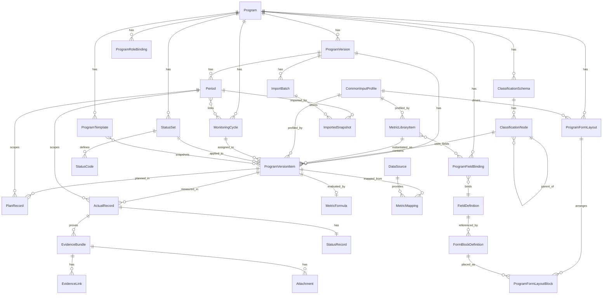

# 범용 성과관리 플랫폼 ERD 초안

## 개요

이 문서는 [기획안_v2.md](c:/Users/DAYOUNG/performance_system/기획안_v2.md)를 기준으로 정리한 ERD 초안이다.

- 최상위 사업 운영 구조는 `Program > ProgramVersion > ProgramVersionItem`이다.
- 전역 재사용 자산 구조는 `SystemManagement > MetricLibraryItem + DataSource + CommonInputProfile`이다.
- 정량/정성은 기본 판단 속성이고, 실제 입력 화면 유형은 `CommonInputProfile`으로 분리해 사용자 정의 가능하게 한다.
- 지표 라이브러리 항목은 `qualitative | quantitative_single | quantitative_composite`로 구분한다.
- 계획/실적/판정/증빙/이관 이력은 모두 `ProgramVersionItem + Period` 조합에 연결된다.
- 권한, 사업 전용 템플릿, API 연계는 별도 엔터티로 분리한다.

## 핵심 관계 요약

- 하나의 `Program`은 여러 `ProgramVersion`, `ClassificationSchema`, `MonitoringCycle`, `StatusSet`, `ProgramTemplate`, `ProgramRoleBinding`, `ProgramFormLayout`을 가진다.
- 하나의 `ProgramVersion`은 여러 `Period`, `ImportBatch`, `ProgramFormLayout`을 가질 수 있다.
- 하나의 `ClassificationSchema`는 여러 `ClassificationNode`를 가진다.
- 하나의 `ClassificationNode`는 자기 자신을 부모로 참조하는 트리 구조를 가진다.
- 하나의 `MetricLibraryItem`은 재사용 기준 항목이며, 여러 `ProgramVersionItem`의 원형이 될 수 있다.
- 하나의 `CommonInputProfile`은 여러 `MetricLibraryItem`, `ProgramVersionItem`, `ProgramFormLayout`에서 재사용될 수 있다.
- 하나의 `DataSource`는 여러 사업에서 공통으로 재사용될 수 있다.
- 하나의 `ProgramVersionItem`은 하나의 `ClassificationNode`, 하나의 `MonitoringCycle`, 선택적 `MetricFormula`를 가진다.
- 하나의 `ProgramVersionItem`은 정량인 경우 `collectionMode(manual/api/hybrid)`를 가진다.
- 하나의 `ProgramVersionItem`은 기간별로 `PlanRecord`, `ActualRecord`, `ImportedSnapshot`을 가진다.
- 하나의 `ActualRecord`는 하나의 `StatusRecord`와 여러 `EvidenceBundle`을 가진다.
- 하나의 `EvidenceBundle`은 여러 첨부파일과 여러 링크를 가진다.
- 하나의 `ProgramVersionItem`은 선택적으로 하나의 `MetricFormula`와 여러 `MetricMapping`을 가진다.
- 별도 `ItemGroup`, `ItemGroupSnapshot` 엔터티는 두지 않고, 여러 지표를 합치는 요구는 `MetricLibraryItem(type=quantitative_composite)`로 처리한다.

## Mermaid ERD

## 엔터티 초안

### 1. Program
- 의미: 사업/성과관리 대단위
- 핵심 키
  - `id`
  - `name`
  - `createdByOrgId`
  - `ownerOrgId`
  - `status`

### 2. ProgramVersion
- 의미: 연도별 또는 특정 차수의 공식 운영본
- 핵심 키
  - `id`
  - `programId`
  - `yearLabel`
  - `versionType`
  - `sourceType`
  - `sourceProgramVersionId`
  - `status`

### 3. ClassificationSchema
- 의미: 사업별 분류체계 정의
- 핵심 키
  - `id`
  - `programId`
  - `description`

### 4. ClassificationNode
- 의미: 분류체계의 실제 노드
- 핵심 키
  - `id`
  - `schemaId`
  - `parentId`
  - `levelId`
  - `name`
  - `code`

### 5. MetricLibraryItem
- 의미: 시스템관리에서 관리하는 재사용 가능한 지표 라이브러리 항목
- 핵심 키
  - `id`
  - `type`
  - `name`
  - `visibilityScope`
- 정량 전용 속성
  - `measurementType`
  - `judgmentMode`
  - `collectionMode`
  - `unit`
  - `targetDirection`
  - `metricFormulaId`
  - `inputProfileId`
  - `sourceProgramId`
  - `sourceProgramVersionId`
  - `sourceProgramVersionItemId`

### 6. ProgramVersionItem
- 의미: 특정 연도 운영본에서 실제로 쓰이는 과제/지표의 고정본
- 핵심 키
  - `id`
  - `programVersionId`
  - `libraryItemId`
  - `schemaNodeId`
  - `type`
  - `name`
  - `ownerOrgId`
  - `monitoringCycleId`
- 정량 전용 속성
  - `measurementType`
  - `judgmentMode`
  - `collectionMode`
  - `unit`
  - `targetDirection`
  - `metricFormulaSnapshot`
  - `inputProfileId`

### 6-1. CommonInputProfile
- 의미: 시스템 공통 또는 프로그램 단위 입력 유형 정의
- 핵심 키
  - `id`
  - `name`
  - `baseType`

### 7. MonitoringCycle
- 의미: 항목별 점검 주기
- 핵심 키
  - `id`
  - `programId`
  - `name`
  - `type`

### 8. Period
- 의미: 실제 입력/집계 기준 기간
- 핵심 키
  - `id`
  - `programId`
  - `programVersionId`
  - `name`
  - `typeCode`
  - `startDate`
  - `endDate`
  - `dueDate`

### 9. PlanRecord
- 의미: 항목의 기간별 계획값
- 유니크 후보 키
  - `(programVersionItemId, periodId)`

### 10. ActualRecord
- 의미: 항목의 기간별 실적값
- 유니크 후보 키
  - `(programVersionItemId, periodId)`
- 핵심 속성
  - `apiValue`
  - `manualValue`
  - `finalValue`
  - `valueSource`
  - `valueReason`
  - `dataCollectionMethod`
  - `importBatchId`
  - `version`
  - `inputByUserId`
  - `updatedByUserId`

### 11. StatusSet / StatusCode / StatusRecord
- `StatusSet`
  - 의미: 사업 또는 기간유형별 상태 체계
  - 권장 연결 키: `periodTypeCode`
- `StatusCode`
  - 의미: 개별 상태 코드 정의
  - 권장 유니크 후보 키: `(statusSetId, code)`
- `StatusRecord`
  - 의미: 실적 레코드에 대한 자동/수기/최종 판정 기록
  - 유니크 후보 키: `(actualRecordId)`
  - 상태 변경 이력의 주체는 사용자 개인 단위로 기록
- `StatusHistory`
  - 의미: 상태 변경 이력 로그
  - 권장 유니크 키: `(id)`

### 12. EvidenceBundle / EvidenceLink / Attachment
- `EvidenceBundle`
  - 의미: 실적 1건에 대한 증빙 묶음
  - 원칙: 증빙 이력 테이블 없이 현재본만 관리
- `EvidenceLink`
  - 의미: URL 기반 증빙
- `Attachment`
  - 의미: 파일형 증빙 메타데이터

### 13. FieldDefinition / ProgramFieldBinding / FormBlockDefinition / ProgramFormLayout / ProgramTemplate
- `FieldDefinition`
  - 의미: 공통 필드 라이브러리
- `ProgramFieldBinding`
  - 의미: 사업/유형별 필드 배치 규칙
- `FormBlockDefinition`
  - 의미: 입력폼을 구성하는 블록 정의
  - 타입 예: `field`, `info_card`, `warning_card`, `plain_text`, `section_title`, `divider`
- `ProgramFormLayout`
  - 의미: 사업/운영본별 입력 화면 레이아웃 정의
- `ProgramFormLayoutBlock`
  - 의미: 개별 블록의 순서, 위치, 적용 범위 정의
- `ProgramTemplate`
  - 의미: 특정 사업의 운영본 구성을 재사용하기 위한 사업 전용 템플릿

### 14. DataSource / MetricMapping / MetricFormula
- `DataSource`
  - 의미: 외부 또는 내부 시스템 연계 원천
- `MetricMapping`
  - 의미: 데이터 원천 필드와 해당 연도 `ProgramVersionItem` 연결
- `MetricFormula`
  - 의미: 자동 판정/계산 규칙
  - 원칙: 정량 항목이 `collectionMode=manual`인 경우 없어도 됨

### 17. ImportBatch / ImportedSnapshot
- `ImportBatch`
  - 의미: 엑셀 업로드 또는 일괄 적재 작업
  - 권장 연결 키: `programVersionId`
- `ImportedSnapshot`
  - 의미: 엑셀 적재 당시 원본값 보존
  - 목적: 운영 중 값이 바뀌어도 최초 업로드 기준값 비교 가능
  - 권장 연결 키: `programVersionItemId`

### 18. ProgramRoleBinding
- 의미: 프로그램 단위 권한 바인딩
- 권한 부여 원칙
  - 기본 권한은 부서 단위로 부여
  - 예외적으로 `external_reviewer`는 개인 단위 읽기 권한 허용
  - `external_reviewer`의 범위는 `program` 전체 조회로 고정
  - 권한 범위는 `program` 또는 `classification_node`까지만 허용
- 핵심 키
  - `id`
  - `programId`
  - `principalType`
  - `organizationId`
  - `userId`
  - `role`
  - `scopeType`
  - `scopeId`

## 권장 유니크 제약

- `ClassificationSchema`
  - `(programId, id)`
- `ClassificationNode`
  - `(schemaId, parentId, code)`
- `MetricLibraryItem`
  - `(id)`
- `ProgramVersion`
  - `(programId, yearLabel, versionType)`
- `ProgramVersionItem`
  - `(programVersionId, id)`
- `PlanRecord`
  - `(programVersionItemId, periodId)`
- `ActualRecord`
  - `(programVersionItemId, periodId)`
- `StatusRecord`
  - `(actualRecordId)`
- `StatusHistory`
  - `(id)`
- `ProgramFieldBinding`
  - `(programId, fieldId, schemaLevelId, itemTypeFilter)`
- `ProgramFormLayoutBlock`
  - `(layoutId, displayOrder)`
- `MetricMapping`
  - `(dataSourceId, programVersionItemId, sourceFieldPath)`
- `ProgramRoleBinding`
  - `(programId, principalType, organizationId, userId, role, scopeType, scopeId)`

## 논리 모델 보완 메모

- `ClassificationSchema.levels`는 실제 물리 ERD에서는 별도 `ClassificationLevel` 테이블로 분리하는 편이 안정적이다.
- `Period`와 `MonitoringCycle`의 다대다 연결은 실제 DB에서 `PeriodMonitoringCycle` 조인 테이블로 푸는 것이 적절하다.
- `MetricLibraryItem`과 합성 정량 지표의 구성 관계는 `MetricLibraryItemComponent` 조인 테이블로 분리하는 편이 적절하다.
- `ProgramVersion`과 `ProgramVersionItem`은 연도별 과제/지표/산식 변경을 보존하기 위한 공식 운영 스냅샷 구조다.
- `ProgramTemplate`는 보통 `ProgramVersion` 또는 `ProgramVersionItem` 스냅샷에서 생성하는 것이 적절하다.
- 입력폼 구성은 `FieldDefinition`과 별도로 `FormBlockDefinition`, `ProgramFormLayout`, `ProgramFormLayoutBlock`으로 분리하는 것이 적절하다.
- `StatusSet` 내부 `statuses` 배열은 실제 DB에서는 `StatusCode` 테이블로 분리하는 편이 좋다.
- `StatusRecord`는 현재값 저장, `StatusHistory`는 변경 이력 저장으로 분리하는 편이 좋다.
- `EvidenceBundle.attachments`, `EvidenceBundle.evidenceLinks`도 각각 별도 테이블로 두는 것이 정규화에 맞다.
- 증빙은 현재본만 관리하고, 별도 이력 테이블을 두지 않는다.

## 물리 테이블 전개 권장안

- `programs`
- `classification_schemas`
- `classification_levels`
- `classification_nodes`
- `metric_library_items`
- `metric_library_item_components`
- `program_versions`
- `program_version_items`
- `monitoring_cycles`
- `periods`
- `period_monitoring_cycles`
- `field_definitions`
- `program_field_bindings`
- `form_block_definitions`
- `program_form_layouts`
- `program_form_layout_blocks`
- `program_templates`
- `metric_formulas`
- `status_sets`
- `status_codes`
- `plan_records`
- `actual_records`
- `status_records`
- `status_history`
- `evidence_bundles`
- `evidence_links`
- `attachments`
- `data_sources`
- `metric_mappings`
- `import_batches`
- `imported_snapshots`
- `program_role_bindings`
- `audit_logs`

## 남은 설계 결정사항

- `ClassificationLevel`을 JSON으로 둘지 별도 테이블로 둘지
- `ProgramVersion` 최종 확정(편집 불가) 이전까지 구조 변경 허용 범위를 어디까지 둘지

## 확정 원칙

- `Program`의 생성 주체와 운영 주체는 분리 가능하다.
- `Program.ownerOrgId`는 해당 Program의 기본 운영 주관 부서다.
- 연도별 실제 운영 기준은 `ProgramVersion`과 `ProgramVersionItem`으로 고정한다.
- 계획/실적/상태/증빙은 지표 라이브러리 항목이 아니라 `ProgramVersionItem` 기준으로 연결한다.
- `MetricLibraryItem`은 재사용 원형이며, 연도별 실제 담당 부서는 `ProgramVersionItem.ownerOrgId`로 관리한다.
- `DataSource`는 Program 소속이 아니라 시스템관리의 전역 자산으로 관리한다.
- 계획/실적/상태/증빙의 입력 및 수정 로그는 사용자 개인 단위로 기록한다.
- `ProgramRoleBinding`은 부서 단위 권한만 관리한다.
- `ProgramRoleBinding`은 기본적으로 부서 단위 권한을 관리하되, `external_reviewer`는 개인 단위 예외로 허용한다.
- `ProgramRoleBinding.scopeType`은 `program` 또는 `classification_node`까지만 사용한다.
- `external_reviewer`는 `scopeType=program`만 허용한다.
- 합성 지표는 별도 사업 내부 묶음 엔터티가 아니라 `MetricLibraryItem(type=quantitative_composite)` 정의를 통해 계산한다.
- 증빙은 현재본만 관리하고, 별도 증빙 이력 테이블은 두지 않는다.
- 정량 항목은 `manual`, `api`, `hybrid` 수집 방식을 모두 지원한다.
- 정량 실적의 공식 판단값은 `finalValue`를 기준으로 하며, `apiValue`와 `manualValue`는 원천 추적용으로 함께 보존한다.
- `StatusRecord`는 현재 상태를, `StatusHistory`는 상태 변경 이력을 관리한다.
- `Period` 유형은 고정 enum이 아니라 관리자 정의 `typeCode`로 관리한다.
